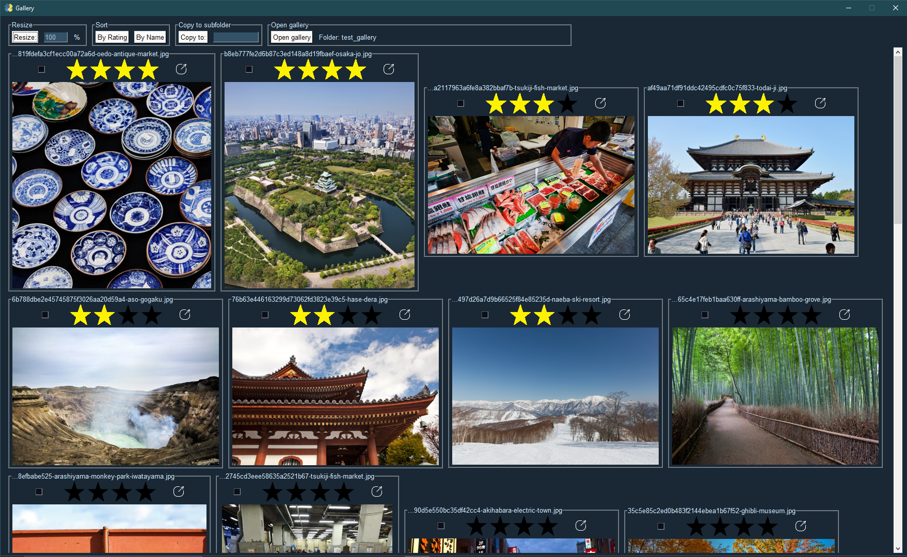

# gallery

### Image browser and editor



- View, rate, sort, move, and edit image galleries
- Perfect for selecting and sorting images to keep from a large gallery
- Built with [PySimpleGUI](https://pysimplegui.readthedocs.io/en/latest/)


### Run instructions

You will need:
- Python 3
- pip

1. Clone this github repo OR download and unzip this repo
2. Go the downloaded project directory and run: ```pip install -r .\requirements.txt```
3. Run: ```python gallery.py```